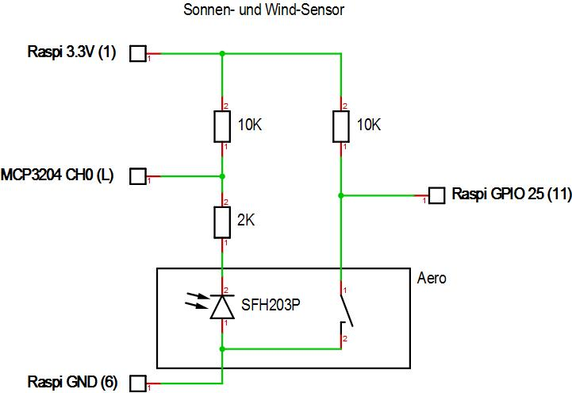
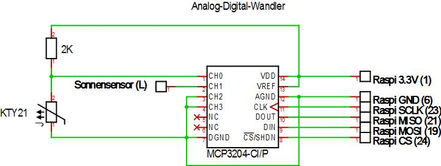
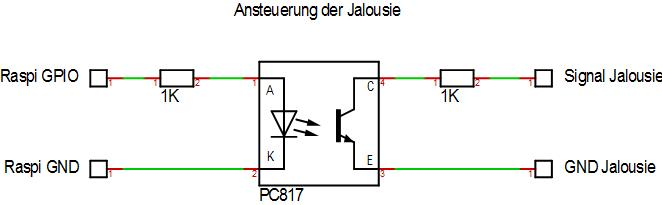

# jalousie

`jalousie` ist eine Raspberry Pi basierte Jalousiesteuerung,
die bei mir die kabelgebundene
[Elero AeroTec](https://www.elero.de/de/produkte/steuerungen/aerotec/)
ersetzt.

Warum?

`jalousie` bietet folgende Vorteile:

- Verbindet die Funktionen von `AeroTec` (Sonnen- und Windsteuerung) und
`AstroTec` (Sonnenauf- und untergangszeiten).
- Zusätzlicher Zugang zum Auslesen der aktuellen Parameter und
zur Steuerung per Browser.
- Speichern von Trenddaten.

## Technologie

- Raspberry Pi
- raspbian
- pigpiod
- node.js

## Features

## Installation

## Schaltplan

### Sonnen- & Windsensor

<kbd>

</kbd>

### A/D Wandler

### Jalousiesteuerung

## Usage
