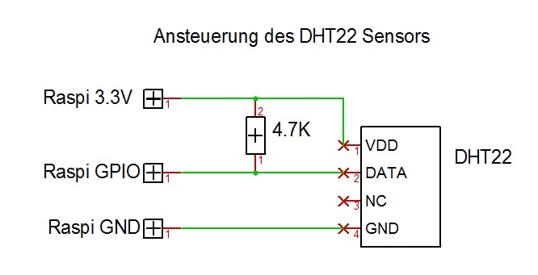
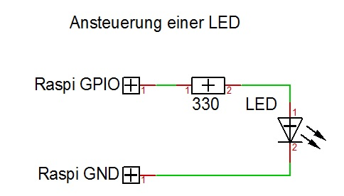

# jalousie

`jalousie` ist eine Raspberry Pi basierte Jalousiesteuerung,
die bei mir die kabelgebundene
[Elero AeroTec](https://www.elero.de/de/produkte/steuerungen/aerotec/)
ersetzt.

Warum?

`jalousie` bietet folgende Vorteile:

- Verbindet die Funktionen von `AeroTec` (Sonnen- und Windsteuerung) und
`AstroTec` (Sonnenauf- und untergangszeiten).
- Zusätzlicher Zugang zum Auslesen der aktuellen Parameter und
zur Steuerung per Browser.
- Speichern von Trenddaten.

## Technologie

- Raspberry Pi
- raspbian
- pigpiod
- node.js

## Features

## Installation

```
<install pigpiod / http://abyz.co.uk/rpi/pigpio/download.html>

sudo apt-get install rrdtool librrd-dev
<rrdtool 1.6.0 / https://github.com/oetiker/rrdtool-1.x >

<letsencrypt>

<vcontrold / https://github.com/c4rd0n/vcontrold.git / http://openv.wikispaces.com/vcontrold >
- serial
- spi

```

## Schaltplan

### Sonnen- & Windsensor

Der `Aero` Sensor besteht intern aus dem Helligkeitssensor `SFH203P`
und einem Schaltkontakt, der bei jeder Drehung des Windsensor
einmal geöffnet wird.

Der Helligkeitssensor wird über den A/D Wandler ausgelesen.

Der Windsensor kann mit einem Pull-Up Widerstand direkt an einen
GPIO Pin angeschlossen werden.

<kbd>

</kbd>

### A/D Wandler

Der A/D Wandler ist für den Sonnensensor zuständig.

Ausserdem ist hier ein `KTY21` Temperatursensor für die Innentemperatur
angeschlossen, allerdings habe ich diesen durch den `DHT22` Sensor ersetzt,
da der `KTY21` schwierig genau in den tatsächlichen Temperaturwert
zu übersetzen ist.

<kbd>

</kbd>

### Jalousiesteuerung

Die Eingänge der Jalousiesteuerung sind mit einem Pull-Up Widerstand
beschaltet und müssen zum Signalisieren auf Low gezogen werden.

Die Jalousie habe ich über Optokoppler angeschlossen, um sie klar vom
Raspi zu trennen.

TODO noch genauer den Anschluss an Aerotec und VarioTec beschreiben.

<kbd>

</kbd>

### DHT22

Der `DHT22` Temperatur- und Luftfeuchtigkeitssensor ist deutlich einfacher
auszuwerten, als der `KTY21` Sensor. Zusätzlich liefert er noch
die Luftfeuchtigkeit. Zunächst hatte ich einen `DHT11` Sensor, allerdings
schienen bei diesem die Werte für die Luftfeuchtigkeit nicht zu stimmen,
so dass ich ihn ersetzt habe.

<kbd>

</kbd>

### Aussentemperatur / Vito

TODO

### Wetter

TODO

### rrd Datenbank

TODO

### LED

Das folgende Schaltbild dient nur als Referenz, und ist nicht direkt für die Jalousiesteuerung in Verwendung.

<kbd>

</kbd>

## Usage
